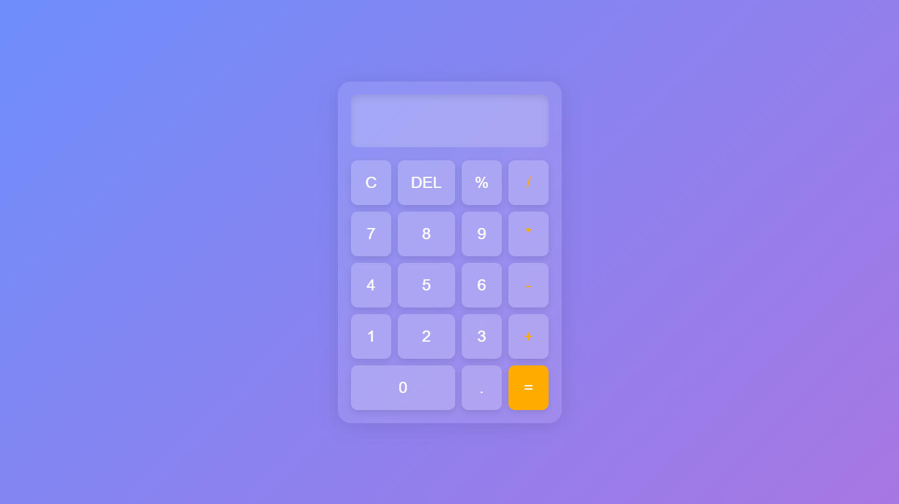

# Glassmorphism Calculator

This project is a stylish calculator built with HTML, CSS, and JavaScript, featuring a modern glassmorphism design. Follow the steps below to set up and run the project on your local machine.

## Demo



## Features
- Clear and delete functions
- Basic arithmetic operations (+, -, *, /, %)
- Responsive design for smaller screens
- Keyboard input support

## Getting Started

### Prerequisites
- Web browser (Chrome, Firefox, Edge, etc.)

### Installation
1. Clone the repository:
   ```bash
   git clone https://github.com/gitnayandas/Glassmorphism-Calculator-Nayan-Das.git

2. Navigate to the project directory: 
    ```bash
    cd glassmorphism-calculator

3. Open index.html in your web browser.

### Usage
Click the buttons to perform calculations.
Use your keyboard to input numbers and operators.
Click "C" to clear the display.
Click "DEL" to delete the last character.

### License
This project is licensed under the MIT License. See the LICENSE file for details.


### Contributing
Contributions are welcome! Feel free to open an issue or submit a pull request.

### Acknowledgements
Inspired by modern UI design trends
Font used: 'Segoe UI', Tahoma, Geneva, Verdana, sans-serif
Background gradient: linear-gradient(135deg, #6e8efb, #a777e3)
Contact
For any questions or feedback, please contact me at [nayanchandradas@hotmail.com].